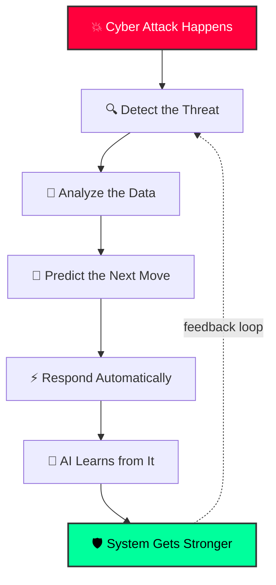
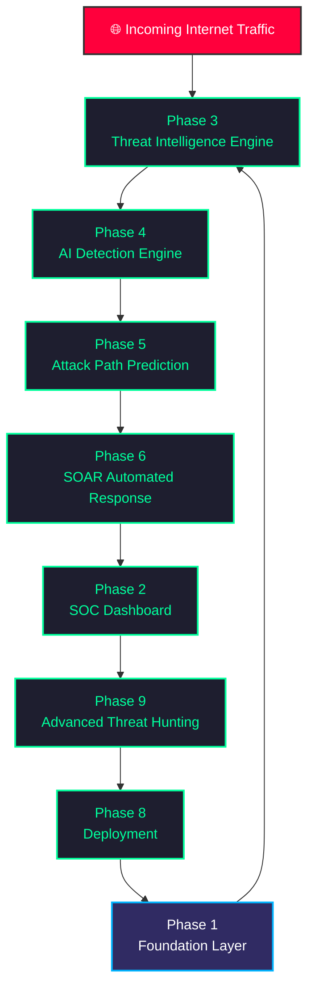
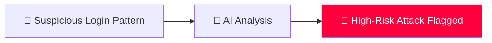
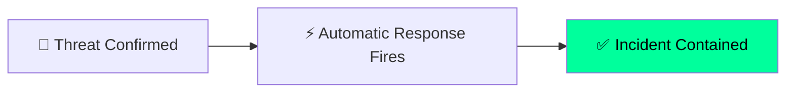
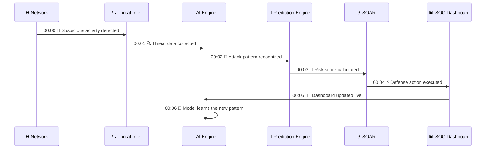
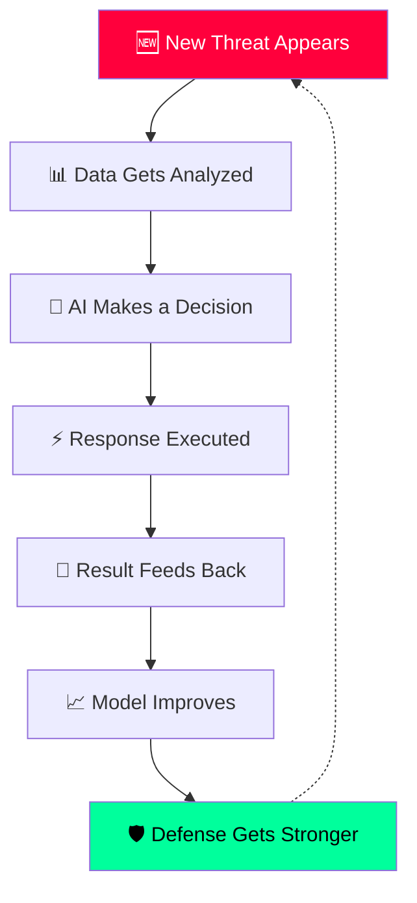
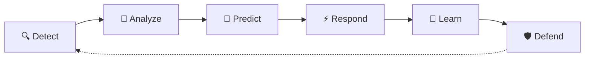

<div align="center">


<br/><br/>

<a href="#">
  
</a>

<br/><br/>


<br/>

```
     ██╗  ██╗ █████╗  ██████╗ ███████╗███╗   ██╗██████╗ ██████╗ ██████╗  █████╗ 
██║ ██╔╝██╔══██╗██╔════╝ ██╔════╝████╗  ██║██╔══██╗██╔══██╗██╔══██╗██╔══██╗
█████╔╝ ███████║██║  ███╗█████╗  ██╔██╗ ██║██║  ██║██████╔╝██████╔╝███████║
██╔═██╗ ██╔══██║██║   ██║██╔══╝  ██║╚██╗██║██║  ██║██╔══██╗██╔══██╗██╔══██║
██║  ██╗██║  ██║╚██████╔╝███████╗██║ ╚████║██████╔╝██║  ██║██║  ██║██║  ██║
╚═╝  ╚═╝╚═╝  ╚═╝ ╚═════╝ ╚══════╝╚═╝  ╚═══╝╚═════╝ ╚═╝  ╚═╝╚═╝  ╚═╝╚═╝  ╚═╝


                         C Y B E R   S E C K H A G E N D R A

           [ NO HUMANS. NO SLEEP. NO MERCY. ]
```

</div>

---

## 📑 `ls -la /system/`

- [🌌 Project Overview](#-project-overview)
- [💻 System Boot Sequence](#-system-boot-sequence)
- [🧬 Core Mission](#-core-mission)
- [🏢 Enterprise SOC Architecture](#-enterprise-soc-architecture)
- [📡 Live Threat Radar](#-live-threat-radar)
- [📂 Phase Ecosystem](#-phase-ecosystem)
- [🔥 Real-Time Attack Simulation](#-real-time-attack-simulation)
- [🧠 AI Self-Learning Loop](#-ai-self-learning-loop)
- [🛠️ Technology Stack](#️-technology-stack)
- [⚙️ Quick Start](#️-quick-start)
- [🏆 System Capabilities](#-final-system-capabilities)
- [🐍 Contribution Activity](#-contribution-activity)
- [🚀 Project Vision](#-project-vision)

---

## 🌌 Project Overview

```
> connecting to mainframe...
> access level: ROOT
> mission: hunt, predict, terminate
```

**AI-Cyber-Threat-Intelligence-System** is a fully autonomous, AI-powered **Security Operations Center (SOC)** — built to sit inside your network like a silent operator that never sleeps.

It watches every packet, fingerprints attackers with machine learning, predicts the next move before it happens, and kills the intrusion automatically — no human needed at 3 AM. Every kill makes the system smarter for the next one.

| Module | Description |
|---|---|
| 🧠 Artificial Intelligence | Behaviour-based anomaly & threat detection |
| 🔍 Threat Intelligence | Global IOC & CVE correlation engine |
| 📊 SOC Monitoring | Real-time dashboard & alerting |
| 🕸️ Attack Path Prediction | Graph-based future attack simulation |
| ⚡ Automated Response (SOAR) | Autonomous incident containment |
| 🎯 Advanced Threat Hunting | Continuous proactive AI hunting |

---

## 💻 System Boot Sequence

<div align="center">

</div>

---

## 🧬 Core Mission

This is the simple, high-level loop the whole system runs on: an attack comes in, it gets detected, analyzed, predicted, stopped, and the AI learns from it — then the loop starts again.



---

## 🏢 Enterprise SOC Architecture

This shows how data flows between every phase of the platform, from the moment a threat touches the network to the moment the system is fully deployed and hunting on its own.



---

## 📡 Live Threat Radar

<div align="center">

</div>

---

## 📂 Phase Ecosystem

```
[ CLASSIFIED — 9 MODULES LOADED — CLEARANCE: ROOT ]
```

<details open>
<summary><b>🏗️ PHASE 1 — Project Foundation</b> <code>[STATUS: LOCKED IN]</code></summary>

<br/>

**Folder:** `Phase-1_Project-Foundation`
**Role:** `System Core Engine`
**Clearance:** `ROOT`

- ✅ Backend Foundation
- ✅ Database Architecture
- ✅ Configuration System
- ✅ Core Services
- ✅ Application Structure

**Output:** `A bulletproof base the rest of the operation stands on`

</details>

<details>
<summary><b>📊 PHASE 2 — SOC Dashboard Development</b> <code>[STATUS: LIVE FEED]</code></summary>

<br/>

**Folder:** `Phase-2_SOC-Dashboard-Development`
**Role:** `Security Command Center`

- ✅ Real-Time Monitoring
- ✅ Threat Visualization
- ✅ Alert Management
- ✅ Risk Dashboard
- ✅ Security Analytics

**Output:** `Eyes-on-glass command center — nothing moves without us seeing it`

</details>

<details>
<summary><b>🌍 PHASE 3 — Threat Intelligence Engine</b> <code>[STATUS: TAPPED IN]</code></summary>

<br/>

**Folder:** `Phase-3_Threat-Intelligence-Engine`
**Role:** `Global Threat Knowledge System`

- ✅ IOC Processing
- ✅ Threat Data Collection
- ✅ Malware Intelligence
- ✅ Threat Correlation
- ✅ Security Information Analysis

**Output:** `A weaponized, searchable intel vault on every known threat actor`

</details>

<details>
<summary><b>🧠 PHASE 4 — AI Threat Detection Engine</b> <code>[STATUS: HUNTING]</code></summary>

<br/>

**Folder:** `Phase-4_AI-Threat-Detection-Engine`
**Role:** `AI Security Brain`

- ✅ Anomaly Detection
- ✅ Behaviour Analysis
- ✅ Threat Classification
- ✅ Risk Calculation
- ✅ AI Decision Making

Here's how a whisper of suspicious activity turns into a confirmed kill order:



</details>

<details>
<summary><b>🕸️ PHASE 5 — Attack Path Prediction</b> <code>[STATUS: FORECASTING]</code></summary>

<br/>

**Folder:** `Phase-5_Attack-Path-Prediction`
**Role:** `Future Attack Simulation Engine`

- ✅ Attack Graph
- ✅ Path Prediction
- ✅ Vulnerability Impact
- ✅ Risk Forecast

<div align="center">

</div>

</details>

<details>
<summary><b>⚡ PHASE 6 — SOAR Automated Response</b> <code>[STATUS: WEAPONIZED]</code></summary>

<br/>

**Folder:** `Phase-6_SOAR-Automated-Response`
**Role:** `Autonomous Defense System`

- ✅ Incident Creation
- ✅ Automated Workflow
- ✅ Threat Blocking
- ✅ SOC Notification



</details>

<details>
<summary><b>🌐 PHASE 7 — Threat Intelligence Integration</b> <code>[STATUS: LINKED]</code></summary>

<br/>

**Folder:** `Phase-7_Threat-Intelligence-and-External-Integrations`
**Role:** `Global Security Connection`

- ✅ External Threat Feeds
- ✅ CVE Intelligence
- ✅ Reputation Analysis
- ✅ Data Enrichment

</details>

<details>
<summary><b>🚀 PHASE 8 — Deployment</b> <code>[STATUS: GO-LIVE]</code></summary>

<br/>

**Folder:** `phase-8-deployment`
**Role:** `Production Operations`

- ✅ Docker Deployment
- ✅ Environment Setup
- ✅ Monitoring
- ✅ Health Checks
- ✅ Production Configuration

</details>

<details>
<summary><b>🎯 PHASE 9 — Advanced AI Threat Hunting</b> <code>[STATUS: STALKING]</code></summary>

<br/>

**Folder:** `Phase-9_Advanced-AI-Threat-Hunting`
**Role:** `Proactive AI Security Hunter`

- ✅ IOC Hunting
- ✅ Attack Pattern Discovery
- ✅ AI Learning
- ✅ Threat Correlation
- ✅ Continuous Improvement

</details>

---

## 🔥 Real-Time Attack Simulation

This is what actually happens, step by step, in the first six seconds after something suspicious touches the network.



---

## 🧠 AI Self-Learning Loop

Every time the system handles a threat, it feeds that experience back into the model — so the next attack is caught faster and blocked harder.



---

## 🛠️ Technology Stack

<div align="center">

### Backend
 

### Frontend
 

### Database


### AI / ML
  

### Deployment
  

</div>

---

## ⚙️ Breach Protocol (Quick Start)

```bash
# clone the payload
git clone https://github.com/your-org/ai-cyber-threat-intelligence-system.git
cd ai-cyber-threat-intelligence-system

# deploy the whole operation
docker-compose up --build

# jack into the SOC dashboard
# → http://localhost:3000

# raw API access
# → http://localhost:8000/docs
```

| Service | Port | Description |
|---|---|---|
| SOC Dashboard | `3000` | React frontend |
| Core API | `8000` | FastAPI backend |
| PostgreSQL | `5432` | Primary database |
| AI Engine | `internal` | ML inference service |

---

## 🏆 Final System Capabilities

```
[✔] AI Threat Detection ......... ARMED
[✔] Real-Time SOC Monitoring ..... LIVE
[✔] Attack Prediction ........... ACTIVE
[✔] Automated Response (SOAR) .... LOADED
[✔] Threat Intel Correlation ..... SYNCED
[✔] Advanced Threat Hunting ...... PROWLING
[✔] Security Analytics ........... TRACKING
[✔] Continuous AI Improvement .... EVOLVING
```

---

## 🐍 Contribution Activity

This repo auto-generates an animated snake that eats through the contribution graph, powered by the included `.github/workflows/snake.yml` (runs on every push, plus every 6 hours on a schedule).

```markdown

```

> ⚠️ The snake only shows up after your first push and after the Action has run once. Push this repo to GitHub, then go to the **Actions** tab and run the "generate contribution snake animation" workflow one time — after that, the image link above will work.

---

## 🚀 Project Vision

```
$ cat mission.txt
we don't wait for the breach.
we hunt before it happens,
we strike before it lands,
and we get smarter every single time.
```



---

<div align="center">

```
> connection to mainframe: terminated
> logging out... root@soc-core
> we were never here.
```


</div>
