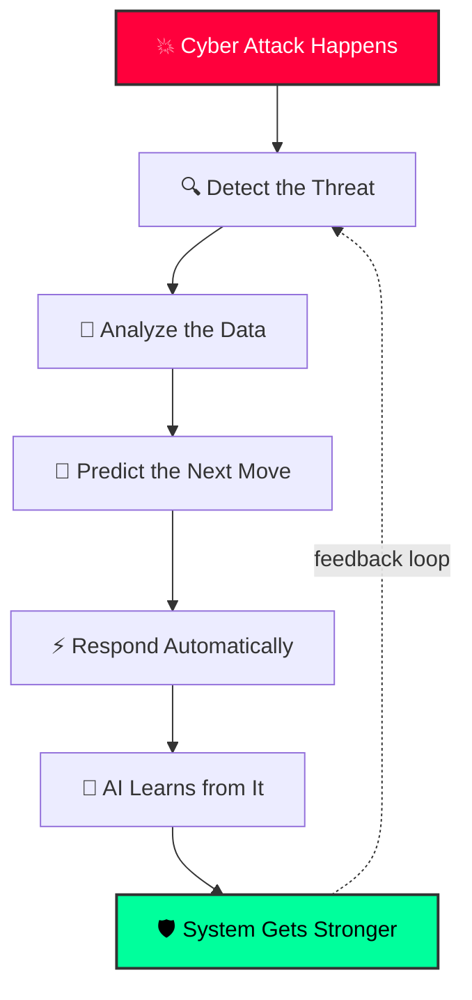
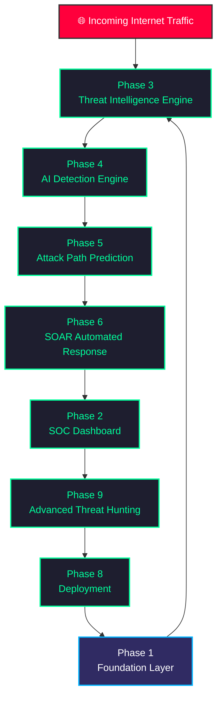
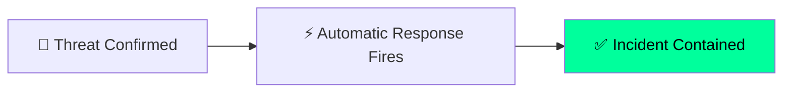
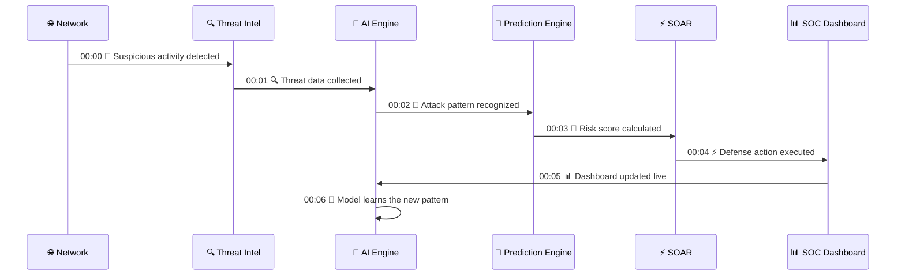
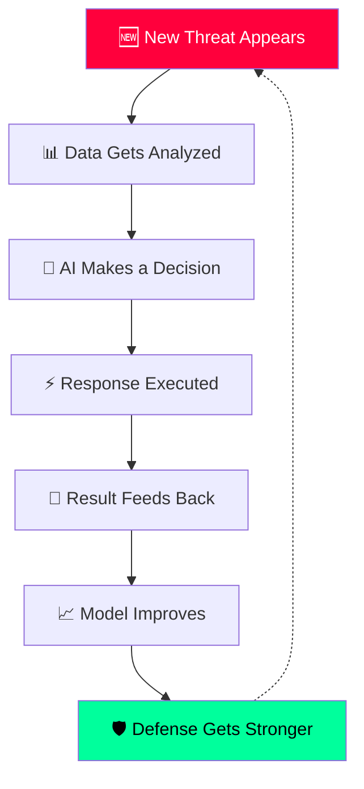
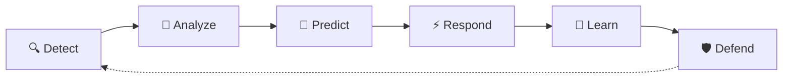

<div align="center">

<img src="data:image/svg+xml;base64,PHN2ZyB2aWV3Qm94PSIwIDAgMTIwMCAyODAiIHhtbG5zPSJodHRwOi8vd3d3LnczLm9yZy8yMDAwL3N2ZyI+CiAgPGRlZnM+CiAgICA8bGluZWFyR3JhZGllbnQgaWQ9ImJnR3JhZCIgeDE9IjAlIiB5MT0iMCUiIHgyPSIxMDAlIiB5Mj0iMTAwJSI+CiAgICAgIDxzdG9wIG9mZnNldD0iMCUiIHN0b3AtY29sb3I9IiMwYTBhMTQiLz4KICAgICAgPHN0b3Agb2Zmc2V0PSI1MCUiIHN0b3AtY29sb3I9IiMxNDE0MmIiLz4KICAgICAgPHN0b3Agb2Zmc2V0PSIxMDAlIiBzdG9wLWNvbG9yPSIjMGEwYTE0Ii8+CiAgICA8L2xpbmVhckdyYWRpZW50PgogICAgPGxpbmVhckdyYWRpZW50IGlkPSJzY2FuR3JhZCIgeDE9IjAlIiB5MT0iMCUiIHgyPSIwJSIgeTI9IjEwMCUiPgogICAgICA8c3RvcCBvZmZzZXQ9IjAlIiBzdG9wLWNvbG9yPSIjMDBmZjljIiBzdG9wLW9wYWNpdHk9IjAiLz4KICAgICAgPHN0b3Agb2Zmc2V0PSI1MCUiIHN0b3AtY29sb3I9IiMwMGZmOWMiIHN0b3Atb3BhY2l0eT0iMC41NSIvPgogICAgICA8c3RvcCBvZmZzZXQ9IjEwMCUiIHN0b3AtY29sb3I9IiMwMGZmOWMiIHN0b3Atb3BhY2l0eT0iMCIvPgogICAgPC9saW5lYXJHcmFkaWVudD4KICAgIDxyYWRpYWxHcmFkaWVudCBpZD0ibm9kZUdsb3ciIGN4PSI1MCUiIGN5PSI1MCUiIHI9IjUwJSI+CiAgICAgIDxzdG9wIG9mZnNldD0iMCUiIHN0b3AtY29sb3I9IiMwMGZmOWMiIHN0b3Atb3BhY2l0eT0iMSIvPgogICAgICA8c3RvcCBvZmZzZXQ9IjEwMCUiIHN0b3AtY29sb3I9IiMwMGZmOWMiIHN0b3Atb3BhY2l0eT0iMCIvPgogICAgPC9yYWRpYWxHcmFkaWVudD4KICAgIDxmaWx0ZXIgaWQ9InNvZnRHbG93IiB4PSItNTAlIiB5PSItNTAlIiB3aWR0aD0iMjAwJSIgaGVpZ2h0PSIyMDAlIj4KICAgICAgPGZlR2F1c3NpYW5CbHVyIHN0ZERldmlhdGlvbj0iNCIgcmVzdWx0PSJibHVyIi8+CiAgICAgIDxmZU1lcmdlPgogICAgICAgIDxmZU1lcmdlTm9kZSBpbj0iYmx1ciIvPgogICAgICAgIDxmZU1lcmdlTm9kZSBpbj0iU291cmNlR3JhcGhpYyIvPgogICAgICA8L2ZlTWVyZ2U+CiAgICA8L2ZpbHRlcj4KICA8L2RlZnM+CgogIDxyZWN0IHdpZHRoPSIxMjAwIiBoZWlnaHQ9IjI4MCIgZmlsbD0idXJsKCNiZ0dyYWQpIi8+CgogIDwhLS0gY2lyY3VpdCBncmlkIC0tPgogIDxnIHN0cm9rZT0iIzFmMmE0NCIgc3Ryb2tlLXdpZHRoPSIxIiBvcGFjaXR5PSIwLjYiPgogICAgPHBhdGggZD0iTTAsNDAgSDEyMDAgTTAsODAgSDEyMDAgTTAsMTIwIEgxMjAwIE0wLDE2MCBIMTIwMCBNMCwyMDAgSDEyMDAgTTAsMjQwIEgxMjAwIi8+CiAgICA8cGF0aCBkPSJNNjAsMCBWMjgwIE0xODAsMCBWMjgwIE0zMDAsMCBWMjgwIE00MjAsMCBWMjgwIE01NDAsMCBWMjgwIE02NjAsMCBWMjgwIE03ODAsMCBWMjgwIE05MDAsMCBWMjgwIE0xMDIwLDAgVjI4MCBNMTE0MCwwIFYyODAiLz4KICA8L2c+CgogIDwhLS0gbW92aW5nIHNjYW4gbGluZSAtLT4KICA8cmVjdCB4PSIwIiB5PSIwIiB3aWR0aD0iMTIwMCIgaGVpZ2h0PSI3MCIgZmlsbD0idXJsKCNzY2FuR3JhZCkiPgogICAgPGFuaW1hdGVUcmFuc2Zvcm0gYXR0cmlidXRlTmFtZT0idHJhbnNmb3JtIiB0eXBlPSJ0cmFuc2xhdGUiIHZhbHVlcz0iMCwtNzA7IDAsMjgwOyAwLC03MCIgZHVyPSI2cyIgcmVwZWF0Q291bnQ9ImluZGVmaW5pdGUiLz4KICA8L3JlY3Q+CgogIDwhLS0gcHVsc2luZyB0aHJlYXQgbm9kZXMgLS0+CiAgPGc+CiAgICA8Y2lyY2xlIGN4PSIxMjAiIGN5PSI2MCIgcj0iNCIgZmlsbD0iI2ZmMDAzYyI+CiAgICAgIDxhbmltYXRlIGF0dHJpYnV0ZU5hbWU9InIiIHZhbHVlcz0iMzs5OzMiIGR1cj0iMi4ycyIgcmVwZWF0Q291bnQ9ImluZGVmaW5pdGUiLz4KICAgICAgPGFuaW1hdGUgYXR0cmlidXRlTmFtZT0ib3BhY2l0eSIgdmFsdWVzPSIxOzAuMjsxIiBkdXI9IjIuMnMiIHJlcGVhdENvdW50PSJpbmRlZmluaXRlIi8+CiAgICA8L2NpcmNsZT4KICAgIDxjaXJjbGUgY3g9IjEwODAiIGN5PSIyMjAiIHI9IjQiIGZpbGw9IiNmZjAwM2MiPgogICAgICA8YW5pbWF0ZSBhdHRyaWJ1dGVOYW1lPSJyIiB2YWx1ZXM9IjM7OTszIiBkdXI9IjIuNnMiIGJlZ2luPSIwLjZzIiByZXBlYXRDb3VudD0iaW5kZWZpbml0ZSIvPgogICAgICA8YW5pbWF0ZSBhdHRyaWJ1dGVOYW1lPSJvcGFjaXR5IiB2YWx1ZXM9IjE7MC4yOzEiIGR1cj0iMi42cyIgYmVnaW49IjAuNnMiIHJlcGVhdENvdW50PSJpbmRlZmluaXRlIi8+CiAgICA8L2NpcmNsZT4KICAgIDxjaXJjbGUgY3g9IjMwMCIgY3k9IjIyMCIgcj0iMyIgZmlsbD0iIzAwYjRmZiI+CiAgICAgIDxhbmltYXRlIGF0dHJpYnV0ZU5hbWU9InIiIHZhbHVlcz0iMjs3OzIiIGR1cj0iMS44cyIgYmVnaW49IjAuM3MiIHJlcGVhdENvdW50PSJpbmRlZmluaXRlIi8+CiAgICA8L2NpcmNsZT4KICAgIDxjaXJjbGUgY3g9Ijk1MCIgY3k9IjU1IiByPSIzIiBmaWxsPSIjMDBiNGZmIj4KICAgICAgPGFuaW1hdGUgYXR0cmlidXRlTmFtZT0iciIgdmFsdWVzPSIyOzc7MiIgZHVyPSIycyIgYmVnaW49IjFzIiByZXBlYXRDb3VudD0iaW5kZWZpbml0ZSIvPgogICAgPC9jaXJjbGU+CiAgICA8Y2lyY2xlIGN4PSI2MDAiIGN5PSIyNTAiIHI9IjMiIGZpbGw9IiMwMGZmOWMiPgogICAgICA8YW5pbWF0ZSBhdHRyaWJ1dGVOYW1lPSJyIiB2YWx1ZXM9IjI7ODsyIiBkdXI9IjIuNHMiIGJlZ2luPSIwLjJzIiByZXBlYXRDb3VudD0iaW5kZWZpbml0ZSIvPgogICAgPC9jaXJjbGU+CiAgPC9nPgoKICA8IS0tIHNoaWVsZCBjb3JlIC0tPgogIDxnIHRyYW5zZm9ybT0idHJhbnNsYXRlKDYwMCwxNDApIiBmaWx0ZXI9InVybCgjc29mdEdsb3cpIj4KICAgIDxjaXJjbGUgcj0iNDYiIGZpbGw9InVybCgjbm9kZUdsb3cpIiBvcGFjaXR5PSIwLjUiPgogICAgICA8YW5pbWF0ZSBhdHRyaWJ1dGVOYW1lPSJyIiB2YWx1ZXM9IjQwOzU0OzQwIiBkdXI9IjNzIiByZXBlYXRDb3VudD0iaW5kZWZpbml0ZSIvPgogICAgPC9jaXJjbGU+CiAgICA8cGF0aCBkPSJNMCwtMjYgTDIyLC0xNiBWNiBDMjIsMjIgMTAsMzIgMCwzNiBDLTEwLDMyIC0yMiwyMiAtMjIsNiBWLTE2IFoiCiAgICAgICAgICBmaWxsPSJub25lIiBzdHJva2U9IiMwMGZmOWMiIHN0cm9rZS13aWR0aD0iMi41Ii8+CiAgICA8cGF0aCBkPSJNLTksMCBMLTIsOCBMMTEsLTkiIGZpbGw9Im5vbmUiIHN0cm9rZT0iIzAwZmY5YyIgc3Ryb2tlLXdpZHRoPSIyLjUiIHN0cm9rZS1saW5lY2FwPSJyb3VuZCIgc3Ryb2tlLWxpbmVqb2luPSJyb3VuZCI+CiAgICAgIDxhbmltYXRlIGF0dHJpYnV0ZU5hbWU9InN0cm9rZS1kYXNoYXJyYXkiIHZhbHVlcz0iMCw0MDsgNDAsNDAiIGR1cj0iMS40cyIgYmVnaW49IjAuNXMiIGZpbGw9ImZyZWV6ZSIvPgogICAgPC9wYXRoPgogIDwvZz4KCiAgPCEtLSB0aXRsZSAtLT4KICA8dGV4dCB4PSI2MDAiIHk9IjkwIiB0ZXh0LWFuY2hvcj0ibWlkZGxlIiBmb250LWZhbWlseT0iRmlyYSBDb2RlLCBtb25vc3BhY2UiIGZvbnQtd2VpZ2h0PSI3MDAiCiAgICAgICAgZm9udC1zaXplPSIzNCIgZmlsbD0iIzAwZmY5YyIgZmlsdGVyPSJ1cmwoI3NvZnRHbG93KSI+CiAgICBBSSBDWUJFUiBUSFJFQVQgSU5URUxMSUdFTkNFIFNZU1RFTQogICAgPGFuaW1hdGUgYXR0cmlidXRlTmFtZT0ib3BhY2l0eSIgdmFsdWVzPSIwLjc1OzE7MC43NSIgZHVyPSIyLjVzIiByZXBlYXRDb3VudD0iaW5kZWZpbml0ZSIvPgogIDwvdGV4dD4KICA8dGV4dCB4PSI2MDAiIHk9IjIzMCIgdGV4dC1hbmNob3I9Im1pZGRsZSIgZm9udC1mYW1pbHk9IkZpcmEgQ29kZSwgbW9ub3NwYWNlIiBmb250LXNpemU9IjE2IiBmaWxsPSIjN2Q4ZmIzIj4KICAgIEFVVE9OT01PVVMgU09DIMK3IFJFQUwtVElNRSBERVRFQ1RJT04gwrcgUFJFRElDVElWRSBERUZFTlNFCiAgPC90ZXh0PgoKICA8IS0tIHRyYXZlbGluZyBwYWNrZXQgYWxvbmcgdG9wIGVkZ2UgLS0+CiAgPGNpcmNsZSByPSI0IiBmaWxsPSIjMDBmZjljIj4KICAgIDxhbmltYXRlTW90aW9uIGR1cj0iNHMiIHJlcGVhdENvdW50PSJpbmRlZmluaXRlIgogICAgICBwYXRoPSJNMCwxMCBMMTIwMCwxMCIgLz4KICA8L2NpcmNsZT4KICA8Y2lyY2xlIHI9IjQiIGZpbGw9IiNmZjAwM2MiPgogICAgPGFuaW1hdGVNb3Rpb24gZHVyPSI1cyIgcmVwZWF0Q291bnQ9ImluZGVmaW5pdGUiCiAgICAgIHBhdGg9Ik0xMjAwLDI3MCBMMCwyNzAiIC8+CiAgPC9jaXJjbGU+Cjwvc3ZnPgo=" width="100%" alt="AI Cyber Threat Intelligence System — animated banner"/>

<br/><br/>

<a href="#">
  
</a>

<br/><br/>


</div>

---

## 📑 Table of Contents

- [🌌 Project Overview](#-project-overview)
- [💻 System Boot Sequence](#-system-boot-sequence)
- [🧬 Core Mission](#-core-mission)
- [🏢 Enterprise SOC Architecture](#-enterprise-soc-architecture)
- [📡 Live Threat Radar](#-live-threat-radar)
- [📂 Phase Ecosystem](#-phase-ecosystem)
- [🔥 Real-Time Attack Simulation](#-real-time-attack-simulation)
- [🧠 AI Self-Learning Loop](#-ai-self-learning-loop)
- [🛠️ Technology Stack](#️-technology-stack)
- [⚙️ Quick Start](#️-quick-start)
- [🏆 System Capabilities](#-final-system-capabilities)
- [🐍 Contribution Activity](#-contribution-activity)
- [🚀 Project Vision](#-project-vision)

---

## 🌌 Project Overview

**AI-Cyber-Threat-Intelligence-System** is an advanced AI-powered cybersecurity platform, built to work as a full intelligent **Security Operations Center (SOC)**.

It watches a network non-stop, spots threats using machine learning, guesses what the attacker will try next, and then shuts the attack down automatically — all while it keeps learning from every new event.

| Module | Description |
|---|---|
| 🧠 Artificial Intelligence | Behaviour-based anomaly & threat detection |
| 🔍 Threat Intelligence | Global IOC & CVE correlation engine |
| 📊 SOC Monitoring | Real-time dashboard & alerting |
| 🕸️ Attack Path Prediction | Graph-based future attack simulation |
| ⚡ Automated Response (SOAR) | Autonomous incident containment |
| 🎯 Advanced Threat Hunting | Continuous proactive AI hunting |

---

## 💻 System Boot Sequence

<div align="center">
<img src="data:image/svg+xml;base64,PHN2ZyB2aWV3Qm94PSIwIDAgMTIwMCAzNDAiIHhtbG5zPSJodHRwOi8vd3d3LnczLm9yZy8yMDAwL3N2ZyI+CiAgPGRlZnM+CiAgICA8bGluZWFyR3JhZGllbnQgaWQ9InRlcm1CZyIgeDE9IjAlIiB5MT0iMCUiIHgyPSIwJSIgeTI9IjEwMCUiPgogICAgICA8c3RvcCBvZmZzZXQ9IjAlIiBzdG9wLWNvbG9yPSIjMGQxMTE3Ii8+CiAgICAgIDxzdG9wIG9mZnNldD0iMTAwJSIgc3RvcC1jb2xvcj0iIzA1MDcwYSIvPgogICAgPC9saW5lYXJHcmFkaWVudD4KICA8L2RlZnM+CgogIDxyZWN0IHdpZHRoPSIxMjAwIiBoZWlnaHQ9IjM0MCIgcng9IjE0IiBmaWxsPSJ1cmwoI3Rlcm1CZykiIHN0cm9rZT0iIzAwZmY5YyIgc3Ryb2tlLXdpZHRoPSIxLjUiIG9wYWNpdHk9IjAuOTUiLz4KCiAgPCEtLSB0aXRsZSBiYXIgLS0+CiAgPHJlY3QgeD0iMCIgeT0iMCIgd2lkdGg9IjEyMDAiIGhlaWdodD0iMzQiIHJ4PSIxNCIgZmlsbD0iIzE1MWIyMyIvPgogIDxyZWN0IHg9IjAiIHk9IjIwIiB3aWR0aD0iMTIwMCIgaGVpZ2h0PSIxNCIgZmlsbD0iIzE1MWIyMyIvPgogIDxjaXJjbGUgY3g9IjI0IiBjeT0iMTciIHI9IjYiIGZpbGw9IiNmZjVmNTYiLz4KICA8Y2lyY2xlIGN4PSI0NiIgY3k9IjE3IiByPSI2IiBmaWxsPSIjZmZiZDJlIi8+CiAgPGNpcmNsZSBjeD0iNjgiIGN5PSIxNyIgcj0iNiIgZmlsbD0iIzI3YzkzZiIvPgogIDx0ZXh0IHg9IjYwMCIgeT0iMjIiIHRleHQtYW5jaG9yPSJtaWRkbGUiIGZvbnQtZmFtaWx5PSJGaXJhIENvZGUsIG1vbm9zcGFjZSIgZm9udC1zaXplPSIxMyIgZmlsbD0iIzdkOGZiMyI+c29jLWNvcmVAYm9vdDogfjwvdGV4dD4KCiAgPGcgZm9udC1mYW1pbHk9IkZpcmEgQ29kZSwgbW9ub3NwYWNlIiBmb250LXNpemU9IjE2IiBmaWxsPSIjMDBmZjljIj4KICAgIDx0ZXh0IHg9IjI2IiB5PSI2NiIgb3BhY2l0eT0iMCI+CiAgICAgICZndDsgaW5pdGlhbGl6aW5nIHRocmVhdCBpbnRlbGxpZ2VuY2UgY29yZS4uLgogICAgICA8YW5pbWF0ZSBhdHRyaWJ1dGVOYW1lPSJvcGFjaXR5IiBiZWdpbj0iMC4ycyIgZHVyPSIwLjRzIiBmaWxsPSJmcmVlemUiIHZhbHVlcz0iMDsxIi8+CiAgICA8L3RleHQ+CiAgICA8dGV4dCB4PSIyNiIgeT0iOTQiIG9wYWNpdHk9IjAiIGZpbGw9IiMwMGI0ZmYiPgogICAgICAmZ3Q7IGxvYWRpbmcgQUkgZGV0ZWN0aW9uIG1vZGVscyBbT0tdCiAgICAgIDxhbmltYXRlIGF0dHJpYnV0ZU5hbWU9Im9wYWNpdHkiIGJlZ2luPSIxLjBzIiBkdXI9IjAuNHMiIGZpbGw9ImZyZWV6ZSIgdmFsdWVzPSIwOzEiLz4KICAgIDwvdGV4dD4KICAgIDx0ZXh0IHg9IjI2IiB5PSIxMjIiIG9wYWNpdHk9IjAiIGZpbGw9IiMwMGI0ZmYiPgogICAgICAmZ3Q7IGNvbm5lY3RpbmcgdGhyZWF0IGZlZWRzLi4uIDIxNCBzb3VyY2VzIGxpbmtlZAogICAgICA8YW5pbWF0ZSBhdHRyaWJ1dGVOYW1lPSJvcGFjaXR5IiBiZWdpbj0iMS44cyIgZHVyPSIwLjRzIiBmaWxsPSJmcmVlemUiIHZhbHVlcz0iMDsxIi8+CiAgICA8L3RleHQ+CiAgICA8dGV4dCB4PSIyNiIgeT0iMTUwIiBvcGFjaXR5PSIwIiBmaWxsPSIjZmZiZDJlIj4KICAgICAgJmd0OyB3YXJuaW5nOiAzIHVucGF0Y2hlZCBDVkVzIGZvdW5kIG9uIHN1Ym5ldCAxMC4wLjQuMC8yNAogICAgICA8YW5pbWF0ZSBhdHRyaWJ1dGVOYW1lPSJvcGFjaXR5IiBiZWdpbj0iMi42cyIgZHVyPSIwLjRzIiBmaWxsPSJmcmVlemUiIHZhbHVlcz0iMDsxIi8+CiAgICA8L3RleHQ+CiAgICA8dGV4dCB4PSIyNiIgeT0iMTc4IiBvcGFjaXR5PSIwIiBmaWxsPSIjMDBmZjljIj4KICAgICAgJmd0OyBzdGFydGluZyBhdHRhY2sgcGF0aCBwcmVkaWN0aW9uIGVuZ2luZSBbT0tdCiAgICAgIDxhbmltYXRlIGF0dHJpYnV0ZU5hbWU9Im9wYWNpdHkiIGJlZ2luPSIzLjRzIiBkdXI9IjAuNHMiIGZpbGw9ImZyZWV6ZSIgdmFsdWVzPSIwOzEiLz4KICAgIDwvdGV4dD4KICAgIDx0ZXh0IHg9IjI2IiB5PSIyMDYiIG9wYWNpdHk9IjAiIGZpbGw9IiMwMGZmOWMiPgogICAgICAmZ3Q7IGFybWluZyBTT0FSIGF1dG8tcmVzcG9uc2UgcGxheWJvb2tzIFtPS10KICAgICAgPGFuaW1hdGUgYXR0cmlidXRlTmFtZT0ib3BhY2l0eSIgYmVnaW49IjQuMnMiIGR1cj0iMC40cyIgZmlsbD0iZnJlZXplIiB2YWx1ZXM9IjA7MSIvPgogICAgPC90ZXh0PgogICAgPHRleHQgeD0iMjYiIHk9IjIzNCIgb3BhY2l0eT0iMCIgZmlsbD0iI2ZmMDAzYyI+CiAgICAgICZndDsgaW50cnVzaW9uIGF0dGVtcHQgZGV0ZWN0ZWQ6IDE4NS42Mi54Lngg4oaSIGJsb2NrZWQgaW4gNDJtcwogICAgICA8YW5pbWF0ZSBhdHRyaWJ1dGVOYW1lPSJvcGFjaXR5IiBiZWdpbj0iNS4wcyIgZHVyPSIwLjRzIiBmaWxsPSJmcmVlemUiIHZhbHVlcz0iMDsxIi8+CiAgICA8L3RleHQ+CiAgICA8dGV4dCB4PSIyNiIgeT0iMjYyIiBvcGFjaXR5PSIwIiBmaWxsPSIjMDBmZjljIj4KICAgICAgJmd0OyBTT0MgZGFzaGJvYXJkIGxpdmUgYXQgOjMwMDAKICAgICAgPGFuaW1hdGUgYXR0cmlidXRlTmFtZT0ib3BhY2l0eSIgYmVnaW49IjUuOHMiIGR1cj0iMC40cyIgZmlsbD0iZnJlZXplIiB2YWx1ZXM9IjA7MSIvPgogICAgPC90ZXh0PgogICAgPHRleHQgeD0iMjYiIHk9IjI5NiIgb3BhY2l0eT0iMCIgZm9udC13ZWlnaHQ9IjcwMCIgZmlsbD0iIzAwZmY5YyI+CiAgICAgICZndDsgU1lTVEVNIE9OTElORSDigJQgQUxMIE1PRFVMRVMgQUNUSVZFCiAgICAgIDxhbmltYXRlIGF0dHJpYnV0ZU5hbWU9Im9wYWNpdHkiIGJlZ2luPSI2LjZzIiBkdXI9IjAuNXMiIGZpbGw9ImZyZWV6ZSIgdmFsdWVzPSIwOzEiLz4KICAgIDwvdGV4dD4KICA8L2c+CgogIDwhLS0gYmxpbmtpbmcgY3Vyc29yIC0tPgogIDxyZWN0IHg9IjI2IiB5PSIzMDQiIHdpZHRoPSIxMSIgaGVpZ2h0PSIxOCIgZmlsbD0iIzAwZmY5YyIgb3BhY2l0eT0iMCI+CiAgICA8YW5pbWF0ZSBhdHRyaWJ1dGVOYW1lPSJvcGFjaXR5IiBiZWdpbj0iNy4xcyIgZHVyPSIwLjlzIiByZXBlYXRDb3VudD0iaW5kZWZpbml0ZSIgdmFsdWVzPSIxOzA7MSIvPgogIDwvcmVjdD4KCiAgPCEtLSByZXN0YXJ0IHRoZSB3aG9sZSBzZXF1ZW5jZSAtLT4KICA8YW5pbWF0ZSBhdHRyaWJ1dGVOYW1lPSJvcGFjaXR5IiB2YWx1ZXM9IjE7MSIgZHVyPSI5cyIgcmVwZWF0Q291bnQ9ImluZGVmaW5pdGUiLz4KPC9zdmc+Cg==" width="100%" alt="Animated terminal boot sequence"/>
</div>

---

## 🧬 Core Mission

This is the simple, high-level loop the whole system runs on: an attack comes in, it gets detected, analyzed, predicted, stopped, and the AI learns from it — then the loop starts again.



---

## 🏢 Enterprise SOC Architecture

This shows how data flows between every phase of the platform, from the moment a threat touches the network to the moment the system is fully deployed and hunting on its own.



---

## 📡 Live Threat Radar

<div align="center">

</div>

---

## 📂 Phase Ecosystem

<details open>
<summary><b>🏗️ PHASE 1 — Project Foundation</b></summary>

<br/>

**Folder:** `Phase-1_Project-Foundation`
**Role:** `System Core Engine`

- ✅ Backend Foundation
- ✅ Database Architecture
- ✅ Configuration System
- ✅ Core Services
- ✅ Application Structure

**Output:** `A stable base for the whole cybersecurity platform`

</details>

<details>
<summary><b>📊 PHASE 2 — SOC Dashboard Development</b></summary>

<br/>

**Folder:** `Phase-2_SOC-Dashboard-Development`
**Role:** `Security Command Center`

- ✅ Real-Time Monitoring
- ✅ Threat Visualization
- ✅ Alert Management
- ✅ Risk Dashboard
- ✅ Security Analytics

**Output:** `A live monitoring screen for SOC analysts`

</details>

<details>
<summary><b>🌍 PHASE 3 — Threat Intelligence Engine</b></summary>

<br/>

**Folder:** `Phase-3_Threat-Intelligence-Engine`
**Role:** `Global Threat Knowledge System`

- ✅ IOC Processing
- ✅ Threat Data Collection
- ✅ Malware Intelligence
- ✅ Threat Correlation
- ✅ Security Information Analysis

**Output:** `A searchable threat intelligence database`

</details>

<details>
<summary><b>🧠 PHASE 4 — AI Threat Detection Engine</b></summary>

<br/>

**Folder:** `Phase-4_AI-Threat-Detection-Engine`
**Role:** `AI Security Brain`

- ✅ Anomaly Detection
- ✅ Behaviour Analysis
- ✅ Threat Classification
- ✅ Risk Calculation
- ✅ AI Decision Making

Here's a simple example of how this phase turns a raw signal into an alert:


</details>

<details>
<summary><b>🕸️ PHASE 5 — Attack Path Prediction</b></summary>

<br/>

**Folder:** `Phase-5_Attack-Path-Prediction`
**Role:** `Future Attack Simulation Engine`

- ✅ Attack Graph
- ✅ Path Prediction
- ✅ Vulnerability Impact
- ✅ Risk Forecast

<div align="center">
<img src="data:image/svg+xml;base64,PHN2ZyB2aWV3Qm94PSIwIDAgMTIwMCAzNDAiIHhtbG5zPSJodHRwOi8vd3d3LnczLm9yZy8yMDAwL3N2ZyI+CiAgPGRlZnM+CiAgICA8bGluZWFyR3JhZGllbnQgaWQ9ImFwQmciIHgxPSIwJSIgeTE9IjAlIiB4Mj0iMTAwJSIgeTI9IjEwMCUiPgogICAgICA8c3RvcCBvZmZzZXQ9IjAlIiBzdG9wLWNvbG9yPSIjMGEwYTE0Ii8+CiAgICAgIDxzdG9wIG9mZnNldD0iMTAwJSIgc3RvcC1jb2xvcj0iIzE2MTIzMyIvPgogICAgPC9saW5lYXJHcmFkaWVudD4KICA8L2RlZnM+CiAgPHJlY3Qgd2lkdGg9IjEyMDAiIGhlaWdodD0iMzQwIiBmaWxsPSJ1cmwoI2FwQmcpIi8+CgogIDwhLS0gZ3JhcGggZWRnZXMgLS0+CiAgPGcgc3Ryb2tlPSIjMmMyZjU1IiBzdHJva2Utd2lkdGg9IjIiIGZpbGw9Im5vbmUiPgogICAgPHBhdGggaWQ9ImVkZ2UxIiBkPSJNMTIwLDE3MCBMMzQwLDgwIi8+CiAgICA8cGF0aCBpZD0iZWRnZTIiIGQ9Ik0xMjAsMTcwIEwzNDAsMjYwIi8+CiAgICA8cGF0aCBkPSJNMzQwLDgwIEwzNDAsMjYwIiBvcGFjaXR5PSIwLjQiLz4KICAgIDxwYXRoIGlkPSJlZGdlMyIgZD0iTTM0MCw4MCBMNjAwLDYwIi8+CiAgICA8cGF0aCBpZD0iZWRnZTQiIGQ9Ik0zNDAsMjYwIEw2MDAsMjgwIi8+CiAgICA8cGF0aCBkPSJNNjAwLDYwIEw2MDAsMjgwIiBvcGFjaXR5PSIwLjQiLz4KICAgIDxwYXRoIGlkPSJlZGdlNSIgZD0iTTYwMCw2MCBMODYwLDE3MCIvPgogICAgPHBhdGggaWQ9ImVkZ2U2IiBkPSJNNjAwLDI4MCBMODYwLDE3MCIvPgogICAgPHBhdGggaWQ9ImVkZ2U3IiBkPSJNODYwLDE3MCBMMTA4MCwxNzAiLz4KICA8L2c+CgogIDwhLS0gbm9kZXMgLS0+CiAgPGcgZm9udC1mYW1pbHk9IkZpcmEgQ29kZSwgbW9ub3NwYWNlIiBmb250LXNpemU9IjEzIiBmaWxsPSIjYzlkNGVmIj4KICAgIDxjaXJjbGUgY3g9IjEyMCIgY3k9IjE3MCIgcj0iMjAiIGZpbGw9IiMxZTFlMmYiIHN0cm9rZT0iIzAwYjRmZiIgc3Ryb2tlLXdpZHRoPSIyIi8+CiAgICA8dGV4dCB4PSIxMjAiIHk9IjIxMCIgdGV4dC1hbmNob3I9Im1pZGRsZSI+RW50cnkgUG9pbnQ8L3RleHQ+CgogICAgPGNpcmNsZSBjeD0iMzQwIiBjeT0iODAiIHI9IjE4IiBmaWxsPSIjMWUxZTJmIiBzdHJva2U9IiMwMGI0ZmYiIHN0cm9rZS13aWR0aD0iMiIvPgogICAgPHRleHQgeD0iMzQwIiB5PSI1NSIgdGV4dC1hbmNob3I9Im1pZGRsZSI+V2ViIFNlcnZlcjwvdGV4dD4KCiAgICA8Y2lyY2xlIGN4PSIzNDAiIGN5PSIyNjAiIHI9IjE4IiBmaWxsPSIjMWUxZTJmIiBzdHJva2U9IiMwMGI0ZmYiIHN0cm9rZS13aWR0aD0iMiIvPgogICAgPHRleHQgeD0iMzQwIiB5PSIyOTgiIHRleHQtYW5jaG9yPSJtaWRkbGUiPlVzZXIgRW5kcG9pbnQ8L3RleHQ+CgogICAgPGNpcmNsZSBjeD0iNjAwIiBjeT0iNjAiIHI9IjE4IiBmaWxsPSIjMWUxZTJmIiBzdHJva2U9IiNmZmJkMmUiIHN0cm9rZS13aWR0aD0iMiIvPgogICAgPHRleHQgeD0iNjAwIiB5PSIzNSIgdGV4dC1hbmNob3I9Im1pZGRsZSI+VnVsbjogQ1ZFLTIwMjQteDwvdGV4dD4KCiAgICA8Y2lyY2xlIGN4PSI2MDAiIGN5PSIyODAiIHI9IjE4IiBmaWxsPSIjMWUxZTJmIiBzdHJva2U9IiNmZmJkMmUiIHN0cm9rZS13aWR0aD0iMiIvPgogICAgPHRleHQgeD0iNjAwIiB5PSIzMTUiIHRleHQtYW5jaG9yPSJtaWRkbGUiPldlYWsgQ3JlZGVudGlhbDwvdGV4dD4KCiAgICA8Y2lyY2xlIGN4PSI4NjAiIGN5PSIxNzAiIHI9IjIwIiBmaWxsPSIjMWUxZTJmIiBzdHJva2U9IiNmZjAwM2MiIHN0cm9rZS13aWR0aD0iMiIvPgogICAgPHRleHQgeD0iODYwIiB5PSIyMTAiIHRleHQtYW5jaG9yPSJtaWRkbGUiPkRvbWFpbiBBZG1pbjwvdGV4dD4KCiAgICA8Y2lyY2xlIGN4PSIxMDgwIiBjeT0iMTcwIiByPSIyMiIgZmlsbD0iIzFlMWUyZiIgc3Ryb2tlPSIjZmYwMDNjIiBzdHJva2Utd2lkdGg9IjMiLz4KICAgIDx0ZXh0IHg9IjEwODAiIHk9IjIxMCIgdGV4dC1hbmNob3I9Im1pZGRsZSIgZm9udC13ZWlnaHQ9IjcwMCIgZmlsbD0iI2ZmMDAzYyI+Q1JJVElDQUwgQVNTRVQ8L3RleHQ+CiAgPC9nPgoKICA8IS0tIHRyYXZlbGluZyBhdHRhY2tlciBkb3QgYWxvbmcgcHJlZGljdGVkIHBhdGggLS0+CiAgPGNpcmNsZSByPSI3IiBmaWxsPSIjZmYwMDNjIj4KICAgIDxhbmltYXRlTW90aW9uIGR1cj0iNHMiIHJlcGVhdENvdW50PSJpbmRlZmluaXRlIgogICAgICBrZXlQb2ludHM9IjA7MC4xNDswLjI4OzAuNDI7MC41NjswLjc7MC44NDsxIgogICAgICBrZXlUaW1lcz0iMDswLjE0OzAuMjg7MC40MjswLjU2OzAuNzswLjg0OzEiCiAgICAgIGNhbGNNb2RlPSJsaW5lYXIiCiAgICAgIHBhdGg9Ik0xMjAsMTcwIEwzNDAsODAgTDM0MCwyNjAgTDYwMCwyODAgTDYwMCw2MCBMODYwLDE3MCBMMTA4MCwxNzAiLz4KICAgIDxhbmltYXRlIGF0dHJpYnV0ZU5hbWU9InIiIHZhbHVlcz0iNTs5OzUiIGR1cj0iMC44cyIgcmVwZWF0Q291bnQ9ImluZGVmaW5pdGUiLz4KICA8L2NpcmNsZT4KCiAgPCEtLSBwdWxzaW5nIGNyaXRpY2FsIGFzc2V0IC0tPgogIDxjaXJjbGUgY3g9IjEwODAiIGN5PSIxNzAiIHI9IjIyIiBmaWxsPSJub25lIiBzdHJva2U9IiNmZjAwM2MiIHN0cm9rZS13aWR0aD0iMiIgb3BhY2l0eT0iMC43Ij4KICAgIDxhbmltYXRlIGF0dHJpYnV0ZU5hbWU9InIiIHZhbHVlcz0iMjI7NDI7MjIiIGR1cj0iMnMiIHJlcGVhdENvdW50PSJpbmRlZmluaXRlIi8+CiAgICA8YW5pbWF0ZSBhdHRyaWJ1dGVOYW1lPSJvcGFjaXR5IiB2YWx1ZXM9IjAuNzswOzAuNyIgZHVyPSIycyIgcmVwZWF0Q291bnQ9ImluZGVmaW5pdGUiLz4KICA8L2NpcmNsZT4KCiAgPHRleHQgeD0iNjAwIiB5PSIzMzAiIHRleHQtYW5jaG9yPSJtaWRkbGUiIGZvbnQtZmFtaWx5PSJGaXJhIENvZGUsIG1vbm9zcGFjZSIgZm9udC1zaXplPSIxNCIgZmlsbD0iIzdkOGZiMyI+CiAgICBQUkVESUNURUQgQVRUQUNLIFBBVEg6IEVudHJ5IOKGkiBXZWIgU2VydmVyIOKGkiBXZWFrIENyZWRlbnRpYWwg4oaSIERvbWFpbiBBZG1pbiDihpIgQ3JpdGljYWwgQXNzZXQKICA8L3RleHQ+Cjwvc3ZnPgo=" width="100%" alt="Animated attack path traversal"/>
</div>

</details>

<details>
<summary><b>⚡ PHASE 6 — SOAR Automated Response</b></summary>

<br/>

**Folder:** `Phase-6_SOAR-Automated-Response`
**Role:** `Autonomous Defense System`

- ✅ Incident Creation
- ✅ Automated Workflow
- ✅ Threat Blocking
- ✅ SOC Notification



</details>

<details>
<summary><b>🌐 PHASE 7 — Threat Intelligence Integration</b></summary>

<br/>

**Folder:** `Phase-7_Threat-Intelligence-and-External-Integrations`
**Role:** `Global Security Connection`

- ✅ External Threat Feeds
- ✅ CVE Intelligence
- ✅ Reputation Analysis
- ✅ Data Enrichment

</details>

<details>
<summary><b>🚀 PHASE 8 — Deployment</b></summary>

<br/>

**Folder:** `phase-8-deployment`
**Role:** `Production Operations`

- ✅ Docker Deployment
- ✅ Environment Setup
- ✅ Monitoring
- ✅ Health Checks
- ✅ Production Configuration

</details>

<details>
<summary><b>🎯 PHASE 9 — Advanced AI Threat Hunting</b></summary>

<br/>

**Folder:** `Phase-9_Advanced-AI-Threat-Hunting`
**Role:** `Proactive AI Security Hunter`

- ✅ IOC Hunting
- ✅ Attack Pattern Discovery
- ✅ AI Learning
- ✅ Threat Correlation
- ✅ Continuous Improvement

</details>

---

## 🔥 Real-Time Attack Simulation

This is what actually happens, step by step, in the first six seconds after something suspicious touches the network.



---

## 🧠 AI Self-Learning Loop

Every time the system handles a threat, it feeds that experience back into the model — so the next attack is caught faster and blocked harder.



---

## 🛠️ Technology Stack

<div align="center">

### Backend
 

### Frontend
 

### Database


### AI / ML
  

### Deployment
  

</div>

---

## ⚙️ Quick Start

```bash
# Clone the repository
git clone https://github.com/your-org/ai-cyber-threat-intelligence-system.git
cd ai-cyber-threat-intelligence-system

# Start with Docker Compose
docker-compose up --build

# Open the SOC Dashboard
# → http://localhost:3000

# Open the API docs
# → http://localhost:8000/docs
```

| Service | Port | Description |
|---|---|---|
| SOC Dashboard | `3000` | React frontend |
| Core API | `8000` | FastAPI backend |
| PostgreSQL | `5432` | Primary database |
| AI Engine | `internal` | ML inference service |

---

## 🏆 Final System Capabilities

- ✅ AI Threat Detection
- ✅ Real-Time SOC Monitoring
- ✅ Attack Prediction
- ✅ Automated Response (SOAR)
- ✅ Threat Intelligence Correlation
- ✅ Advanced Threat Hunting
- ✅ Security Analytics
- ✅ Continuous AI Improvement

---

## 🐍 Contribution Activity

This repo auto-generates an animated snake that eats through the contribution graph, powered by the included `.github/workflows/snake.yml` (runs on every push, plus every 6 hours on a schedule).

```markdown

```

> ⚠️ The snake only shows up after your first push and after the Action has run once. Push this repo to GitHub, then go to the **Actions** tab and run the "generate contribution snake animation" workflow one time — after that, the image link above will work.

---

## 🚀 Project Vision

> *"Building an intelligent cybersecurity platform capable of detecting threats, predicting attacks, automating defense, and continuously learning from every cyber event."*



---

<div align="center">


<img src="data:image/svg+xml;base64,PHN2ZyB2aWV3Qm94PSIwIDAgMTIwMCAyODAiIHhtbG5zPSJodHRwOi8vd3d3LnczLm9yZy8yMDAwL3N2ZyI+CiAgPGRlZnM+CiAgICA8bGluZWFyR3JhZGllbnQgaWQ9ImJnR3JhZCIgeDE9IjAlIiB5MT0iMCUiIHgyPSIxMDAlIiB5Mj0iMTAwJSI+CiAgICAgIDxzdG9wIG9mZnNldD0iMCUiIHN0b3AtY29sb3I9IiMwYTBhMTQiLz4KICAgICAgPHN0b3Agb2Zmc2V0PSI1MCUiIHN0b3AtY29sb3I9IiMxNDE0MmIiLz4KICAgICAgPHN0b3Agb2Zmc2V0PSIxMDAlIiBzdG9wLWNvbG9yPSIjMGEwYTE0Ii8+CiAgICA8L2xpbmVhckdyYWRpZW50PgogICAgPGxpbmVhckdyYWRpZW50IGlkPSJzY2FuR3JhZCIgeDE9IjAlIiB5MT0iMCUiIHgyPSIwJSIgeTI9IjEwMCUiPgogICAgICA8c3RvcCBvZmZzZXQ9IjAlIiBzdG9wLWNvbG9yPSIjMDBmZjljIiBzdG9wLW9wYWNpdHk9IjAiLz4KICAgICAgPHN0b3Agb2Zmc2V0PSI1MCUiIHN0b3AtY29sb3I9IiMwMGZmOWMiIHN0b3Atb3BhY2l0eT0iMC41NSIvPgogICAgICA8c3RvcCBvZmZzZXQ9IjEwMCUiIHN0b3AtY29sb3I9IiMwMGZmOWMiIHN0b3Atb3BhY2l0eT0iMCIvPgogICAgPC9saW5lYXJHcmFkaWVudD4KICAgIDxyYWRpYWxHcmFkaWVudCBpZD0ibm9kZUdsb3ciIGN4PSI1MCUiIGN5PSI1MCUiIHI9IjUwJSI+CiAgICAgIDxzdG9wIG9mZnNldD0iMCUiIHN0b3AtY29sb3I9IiMwMGZmOWMiIHN0b3Atb3BhY2l0eT0iMSIvPgogICAgICA8c3RvcCBvZmZzZXQ9IjEwMCUiIHN0b3AtY29sb3I9IiMwMGZmOWMiIHN0b3Atb3BhY2l0eT0iMCIvPgogICAgPC9yYWRpYWxHcmFkaWVudD4KICAgIDxmaWx0ZXIgaWQ9InNvZnRHbG93IiB4PSItNTAlIiB5PSItNTAlIiB3aWR0aD0iMjAwJSIgaGVpZ2h0PSIyMDAlIj4KICAgICAgPGZlR2F1c3NpYW5CbHVyIHN0ZERldmlhdGlvbj0iNCIgcmVzdWx0PSJibHVyIi8+CiAgICAgIDxmZU1lcmdlPgogICAgICAgIDxmZU1lcmdlTm9kZSBpbj0iYmx1ciIvPgogICAgICAgIDxmZU1lcmdlTm9kZSBpbj0iU291cmNlR3JhcGhpYyIvPgogICAgICA8L2ZlTWVyZ2U+CiAgICA8L2ZpbHRlcj4KICA8L2RlZnM+CgogIDxyZWN0IHdpZHRoPSIxMjAwIiBoZWlnaHQ9IjI4MCIgZmlsbD0idXJsKCNiZ0dyYWQpIi8+CgogIDwhLS0gY2lyY3VpdCBncmlkIC0tPgogIDxnIHN0cm9rZT0iIzFmMmE0NCIgc3Ryb2tlLXdpZHRoPSIxIiBvcGFjaXR5PSIwLjYiPgogICAgPHBhdGggZD0iTTAsNDAgSDEyMDAgTTAsODAgSDEyMDAgTTAsMTIwIEgxMjAwIE0wLDE2MCBIMTIwMCBNMCwyMDAgSDEyMDAgTTAsMjQwIEgxMjAwIi8+CiAgICA8cGF0aCBkPSJNNjAsMCBWMjgwIE0xODAsMCBWMjgwIE0zMDAsMCBWMjgwIE00MjAsMCBWMjgwIE01NDAsMCBWMjgwIE02NjAsMCBWMjgwIE03ODAsMCBWMjgwIE05MDAsMCBWMjgwIE0xMDIwLDAgVjI4MCBNMTE0MCwwIFYyODAiLz4KICA8L2c+CgogIDwhLS0gbW92aW5nIHNjYW4gbGluZSAtLT4KICA8cmVjdCB4PSIwIiB5PSIwIiB3aWR0aD0iMTIwMCIgaGVpZ2h0PSI3MCIgZmlsbD0idXJsKCNzY2FuR3JhZCkiPgogICAgPGFuaW1hdGVUcmFuc2Zvcm0gYXR0cmlidXRlTmFtZT0idHJhbnNmb3JtIiB0eXBlPSJ0cmFuc2xhdGUiIHZhbHVlcz0iMCwtNzA7IDAsMjgwOyAwLC03MCIgZHVyPSI2cyIgcmVwZWF0Q291bnQ9ImluZGVmaW5pdGUiLz4KICA8L3JlY3Q+CgogIDwhLS0gcHVsc2luZyB0aHJlYXQgbm9kZXMgLS0+CiAgPGc+CiAgICA8Y2lyY2xlIGN4PSIxMjAiIGN5PSI2MCIgcj0iNCIgZmlsbD0iI2ZmMDAzYyI+CiAgICAgIDxhbmltYXRlIGF0dHJpYnV0ZU5hbWU9InIiIHZhbHVlcz0iMzs5OzMiIGR1cj0iMi4ycyIgcmVwZWF0Q291bnQ9ImluZGVmaW5pdGUiLz4KICAgICAgPGFuaW1hdGUgYXR0cmlidXRlTmFtZT0ib3BhY2l0eSIgdmFsdWVzPSIxOzAuMjsxIiBkdXI9IjIuMnMiIHJlcGVhdENvdW50PSJpbmRlZmluaXRlIi8+CiAgICA8L2NpcmNsZT4KICAgIDxjaXJjbGUgY3g9IjEwODAiIGN5PSIyMjAiIHI9IjQiIGZpbGw9IiNmZjAwM2MiPgogICAgICA8YW5pbWF0ZSBhdHRyaWJ1dGVOYW1lPSJyIiB2YWx1ZXM9IjM7OTszIiBkdXI9IjIuNnMiIGJlZ2luPSIwLjZzIiByZXBlYXRDb3VudD0iaW5kZWZpbml0ZSIvPgogICAgICA8YW5pbWF0ZSBhdHRyaWJ1dGVOYW1lPSJvcGFjaXR5IiB2YWx1ZXM9IjE7MC4yOzEiIGR1cj0iMi42cyIgYmVnaW49IjAuNnMiIHJlcGVhdENvdW50PSJpbmRlZmluaXRlIi8+CiAgICA8L2NpcmNsZT4KICAgIDxjaXJjbGUgY3g9IjMwMCIgY3k9IjIyMCIgcj0iMyIgZmlsbD0iIzAwYjRmZiI+CiAgICAgIDxhbmltYXRlIGF0dHJpYnV0ZU5hbWU9InIiIHZhbHVlcz0iMjs3OzIiIGR1cj0iMS44cyIgYmVnaW49IjAuM3MiIHJlcGVhdENvdW50PSJpbmRlZmluaXRlIi8+CiAgICA8L2NpcmNsZT4KICAgIDxjaXJjbGUgY3g9Ijk1MCIgY3k9IjU1IiByPSIzIiBmaWxsPSIjMDBiNGZmIj4KICAgICAgPGFuaW1hdGUgYXR0cmlidXRlTmFtZT0iciIgdmFsdWVzPSIyOzc7MiIgZHVyPSIycyIgYmVnaW49IjFzIiByZXBlYXRDb3VudD0iaW5kZWZpbml0ZSIvPgogICAgPC9jaXJjbGU+CiAgICA8Y2lyY2xlIGN4PSI2MDAiIGN5PSIyNTAiIHI9IjMiIGZpbGw9IiMwMGZmOWMiPgogICAgICA8YW5pbWF0ZSBhdHRyaWJ1dGVOYW1lPSJyIiB2YWx1ZXM9IjI7ODsyIiBkdXI9IjIuNHMiIGJlZ2luPSIwLjJzIiByZXBlYXRDb3VudD0iaW5kZWZpbml0ZSIvPgogICAgPC9jaXJjbGU+CiAgPC9nPgoKICA8IS0tIHNoaWVsZCBjb3JlIC0tPgogIDxnIHRyYW5zZm9ybT0idHJhbnNsYXRlKDYwMCwxNDApIiBmaWx0ZXI9InVybCgjc29mdEdsb3cpIj4KICAgIDxjaXJjbGUgcj0iNDYiIGZpbGw9InVybCgjbm9kZUdsb3cpIiBvcGFjaXR5PSIwLjUiPgogICAgICA8YW5pbWF0ZSBhdHRyaWJ1dGVOYW1lPSJyIiB2YWx1ZXM9IjQwOzU0OzQwIiBkdXI9IjNzIiByZXBlYXRDb3VudD0iaW5kZWZpbml0ZSIvPgogICAgPC9jaXJjbGU+CiAgICA8cGF0aCBkPSJNMCwtMjYgTDIyLC0xNiBWNiBDMjIsMjIgMTAsMzIgMCwzNiBDLTEwLDMyIC0yMiwyMiAtMjIsNiBWLTE2IFoiCiAgICAgICAgICBmaWxsPSJub25lIiBzdHJva2U9IiMwMGZmOWMiIHN0cm9rZS13aWR0aD0iMi41Ii8+CiAgICA8cGF0aCBkPSJNLTksMCBMLTIsOCBMMTEsLTkiIGZpbGw9Im5vbmUiIHN0cm9rZT0iIzAwZmY5YyIgc3Ryb2tlLXdpZHRoPSIyLjUiIHN0cm9rZS1saW5lY2FwPSJyb3VuZCIgc3Ryb2tlLWxpbmVqb2luPSJyb3VuZCI+CiAgICAgIDxhbmltYXRlIGF0dHJpYnV0ZU5hbWU9InN0cm9rZS1kYXNoYXJyYXkiIHZhbHVlcz0iMCw0MDsgNDAsNDAiIGR1cj0iMS40cyIgYmVnaW49IjAuNXMiIGZpbGw9ImZyZWV6ZSIvPgogICAgPC9wYXRoPgogIDwvZz4KCiAgPCEtLSB0aXRsZSAtLT4KICA8dGV4dCB4PSI2MDAiIHk9IjkwIiB0ZXh0LWFuY2hvcj0ibWlkZGxlIiBmb250LWZhbWlseT0iRmlyYSBDb2RlLCBtb25vc3BhY2UiIGZvbnQtd2VpZ2h0PSI3MDAiCiAgICAgICAgZm9udC1zaXplPSIzNCIgZmlsbD0iIzAwZmY5YyIgZmlsdGVyPSJ1cmwoI3NvZnRHbG93KSI+CiAgICBBSSBDWUJFUiBUSFJFQVQgSU5URUxMSUdFTkNFIFNZU1RFTQogICAgPGFuaW1hdGUgYXR0cmlidXRlTmFtZT0ib3BhY2l0eSIgdmFsdWVzPSIwLjc1OzE7MC43NSIgZHVyPSIyLjVzIiByZXBlYXRDb3VudD0iaW5kZWZpbml0ZSIvPgogIDwvdGV4dD4KICA8dGV4dCB4PSI2MDAiIHk9IjIzMCIgdGV4dC1hbmNob3I9Im1pZGRsZSIgZm9udC1mYW1pbHk9IkZpcmEgQ29kZSwgbW9ub3NwYWNlIiBmb250LXNpemU9IjE2IiBmaWxsPSIjN2Q4ZmIzIj4KICAgIEFVVE9OT01PVVMgU09DIMK3IFJFQUwtVElNRSBERVRFQ1RJT04gwrcgUFJFRElDVElWRSBERUZFTlNFCiAgPC90ZXh0PgoKICA8IS0tIHRyYXZlbGluZyBwYWNrZXQgYWxvbmcgdG9wIGVkZ2UgLS0+CiAgPGNpcmNsZSByPSI0IiBmaWxsPSIjMDBmZjljIj4KICAgIDxhbmltYXRlTW90aW9uIGR1cj0iNHMiIHJlcGVhdENvdW50PSJpbmRlZmluaXRlIgogICAgICBwYXRoPSJNMCwxMCBMMTIwMCwxMCIgLz4KICA8L2NpcmNsZT4KICA8Y2lyY2xlIHI9IjQiIGZpbGw9IiNmZjAwM2MiPgogICAgPGFuaW1hdGVNb3Rpb24gZHVyPSI1cyIgcmVwZWF0Q291bnQ9ImluZGVmaW5pdGUiCiAgICAgIHBhdGg9Ik0xMjAwLDI3MCBMMCwyNzAiIC8+CiAgPC9jaXJjbGU+Cjwvc3ZnPgo=" width="100%" alt="footer banner"/>

</div>
